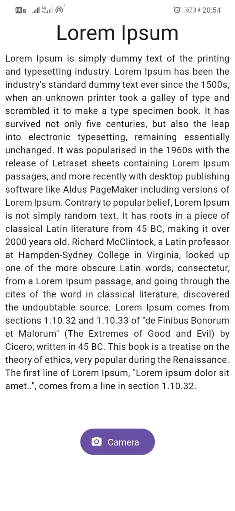

# React Native Practical 02
## 19 Dec 2024

# React Native Expo App

A simple React Native application built with Expo and React Native Paper, featuring a home screen with styled text and a button.

## 🚀 Technologies Used

- **React Native**: A framework for building native apps using React
- **Expo**: An open-source platform for making universal native apps
- **React Native Paper**: Material Design components for React Native
- **Safe Area Context**: Ensures content is displayed within safe boundaries on devices with notches

## 🔧 Key Features

- Material Design styling with React Native Paper
- Safe Area handling for devices with notches
- Cross-platform layout and styling
- Scrollable content within a `ScrollView`

## 📒 Dependencies

- `expo`: ~50.0.0
- `react-native`: 0.73.2
- `react-native-paper`: ^5.10.0
- `react-native-safe-area-context`: ^4.8.2

## 📸 Screenshots
 
**Figure 1: Home Screen with Text and Button**

## 🐝 Components

### Home Component

- Displays a headline, a block of Lorem Ipsum text, and a button styled with React Native Paper.
- The button logs a message to the console when pressed.

### App Component

- Wraps the `Home` component in a `SafeAreaView` and `ScrollView`.
- Provides a `PaperProvider` to enable React Native Paper theming.