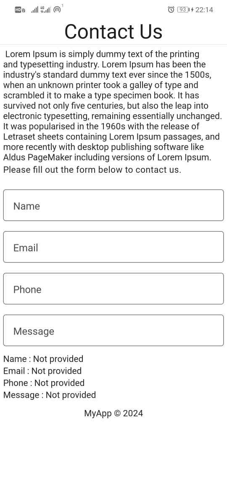
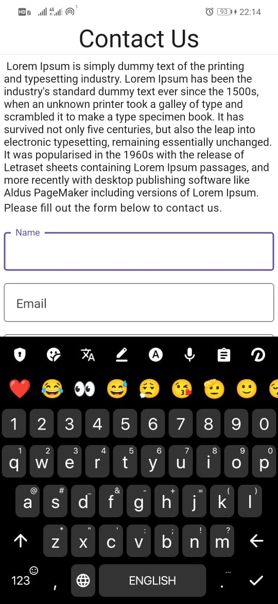
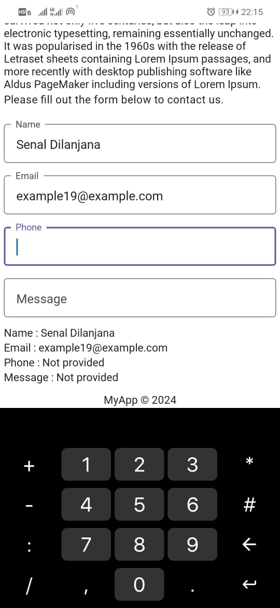
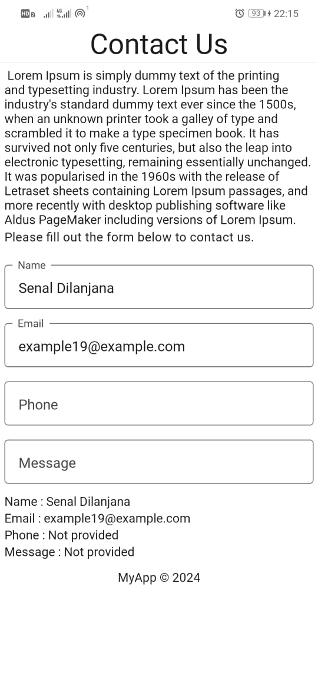
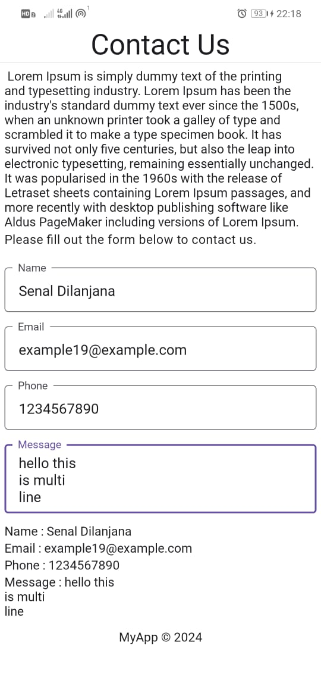

# React Native Practical 02
## 19 Dec 2024

# React Native Expo App

A simple React Native application built with Expo and React Native Paper, featuring a contact form for user input and a summary display.

## 🚀 Technologies Used

- **React Native**: A framework for building native apps using React
- **Expo**: An open-source platform for making universal native apps
- **React Native Paper**: Material Design components for React Native
- **Safe Area Context**: Ensures content is displayed within safe boundaries on devices with notches

## 🔧 Key Features

- Material Design styling with React Native Paper
- Safe Area handling for devices with notches
- Cross-platform layout and styling
- Scrollable content within a `ScrollView`
- Interactive contact form with real-time input handling

## 📸 Screenshots
 
**Figure 1: Default View**

 
**Figure 2: Keyboard View**

 
**Figure 3: Keyboard View**

 
**Figure 4: With Some Fields Filled**

 
**Figure 5: With All Fields Filled**

## 🐝 Components

### ContactUs Component

- Displays a header, instructions, and a contact form.
- Provides real-time feedback by updating user input fields and displaying the current values.

#### Key Features:
- **Input Fields**: Includes fields for name, email, phone, and a multiline message.
- **State Management**: Uses `useState` to manage form input values dynamically.
- **Feedback Display**: Shows the entered values below the form in real-time.

### App Component

- Wraps the `ContactUs` component in a `SafeAreaView`, `ScrollView`, and `KeyboardAvoidingView`.
- Provides a `PaperProvider` to enable React Native Paper theming.
- Handles keyboard behavior on iOS using `KeyboardAvoidingView`.